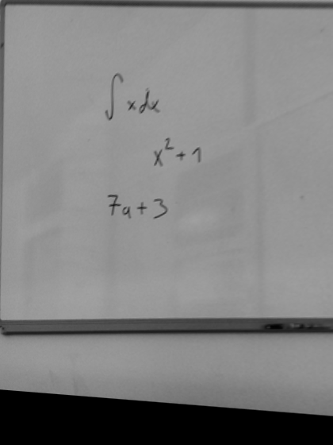

#Rozpoznávání příkladů z tabule

##Úvod, cíl práce

Cílem práce bylo vytvořit program, pomocí kterého bude robot číst příklady napsané na tabuli a hlásit výsledky. Robot by tedy měl pořídit fotografii tabule, na ní rozpoznat jednotlivé příklady a ty postupně spočítat.

Práci je tedy možno rozdělit do třech částí:
* Zpracování fotografie -- rozpoznání tabule a příkladů na ní
* Zpracování příkladů -- převod příkladů (obrázků) do vhodného textového formátu
* Výpočet příkladů -- v tomto případě s využitím API pro jazyk Mathematica 

##Analýza možností získávání textu z obrázků

Při hledání vhodného programu pro rozpoznávání příkladů jsem nejprve testoval program Tesseract (vyvíjen společností Google, zdrojové kódy k dispozici [zde](https://github.com/tesseract-ocr/tesseract)). Tento program zpracovává obrázky pomocí OCR. Ukázalo se, že Tesseract poměrně spolehlivě rozpoznává tištěný text, ručně psané příklady však nikoliv. Další problém je omezená sada rozpoznatelných znaku (která neobsahuje standardní matematické symboly jako suma nebo integrál). Každopádně program by se dal uplatnit v jiných projektech, například pokud by robot měl předčítat zprávy vytištěné na papíru. 

Další testovaný program byl Seshat (zdrojové kódy [zde](https://github.com/falvaro/seshat), možnost vyzkoušet [zde](http://cat.prhlt.upv.es/mer/)). Ten je přímo určen pro rozpoznávání matematických výrazů, podporuje tedy většinu důležitých symbolů. Nevýhoda je, že tento program nezpracovává přímo obrázek, ale posloupnost tahů, které obrázek tvoří.

Řešení, které jsem zvolil je tedy následující: provést předzpracování obrázku pomocí knihovny OpenCV a vytvořit z něj odpovídající posloupnost tahů, která pak bude předána Seshatu k vyhodnocení.

##Zpracování fotografie tabule

V této části bude využita především knihovna pro zpracování obrazu OpenCV (verze 2.4.13). Knihovna kromě C++ podporuje i rozhraní pro Javu, Python a další jazyky. Já jsem se kvůli snadnému prototypování rozhodl pro implementaci programu použít Python (verze 2.7). Funkce z této knihovny v textu začínají **cv2.**.

### Rozpoznání tabule a transformace perspektivy

Nejdřív je potřeba vymezit plochu, na které se budou hledat příklady. Musí se tedy nalézt krajní body tabule a podle těchto bodů transformovat perspektivu tak, aby každý roh tabule odpovídal krajnímu bodu obrázku. Při použití obrázků s rozlišením 640x480 budou tedy krajní body tabule na souřadnicích (0,0), (640,0), (480,0), (640,480).

#### Hledání krajních bodů

Hledání krajních bodů tabule vychází z předpokladu, že tabule tvoří největší čtyřúhelník v obrázku.

Obrázek, ve kterém jsou hledány krajní body je nejprve převeden do odstínů šedé a oprahován funkcí **cv2.adaptiveThreshold()**. Zde se mi osvědčilo ještě před oprahováním na obrázek aplikovat Gaussian blur, který částečně omezí šum. 

Z takto upraveného obrázku jsou pak pomocí funkce **cv2.findContours()** získány kontury. Z těch je pak vybrána největší kontura, která odpovídá čtyřúhelníku. Jestli kontura tvoří čtyřúhelník zjistíme pomocí funkce **cv2.approxPolyDP()** aplikované na konturu. Pokud je křivka nalezná touto funkcí tvořena čtyřmi body, pak kontura tvoří čtyřúhelník.

```python
for contour in contours:
    area = cv2.contourArea(contour)
    if area > 100:
        peri = cv2.arcLength(contour, True)
        approx = cv2.approxPolyDP(contour, 0.02 * peri, True)
        if area > max_area and len(approx) == 4:
            biggest = approx
            max_area = area
```

#### Transformace perspektivy
Krajní body jsou využity k transformaci perspektivy pomocí funkcí **cv2.getPerspectiveTransform()** a **cv2.warpPerspective()**. Funkce **cv2.getPerspectiveTransform()** vytvoří matici transformace podle požadovaných bodů a funkce **cv2.warpPerspective()** pak podle této matice provede transformaci obrázku.

```python
#krajní body tabule
pts1 = np.float32([top_left, bottom_left, top_right, bottom_right])
#krajní body obrázku
pts2 = np.float32([[0, 0], [0, rows], [cols, 0], [cols, rows]])

M = cv2.getPerspectiveTransform(pts1, pts2)
dst = cv2.warpPerspective(gray, M, (rows, cols))
```




### Určení oblasti s textem 

Po transformaci je třeba vymezit části obrázku, kde jsou jednotlivé příklady. Zde je využita funkce **cv2.boundingRect()**, která najde obdélník ohraničující konturu zadanou parametrem. V oprahovaném obrázku se tedy nejprve provede výrazná (15 iterací) dilatace s křížovým kernelem, což zvýrazní příklady. V takto upraveném obrázku se pak najdou kontury (opět funkce **cv2.findContours()**). Pro každou z těchto kontur se vytvoří ohraničující obdélník, a poté se vyřadí příliš velké a příliš malé obdélníky.

Z původního obrázku se pak podle těchto obdélníků vyřežou jednotlivé příklady. Postup nacházení oblastí s textem je naznačen na následujících obrázcích.

#### Zpracování oblastí s textem

Pro rozpoznání příkladu je potřeba u každé textové oblasti provést předzpracování. Jedná se o aplikaci Guo-Hallovat algoritmu a nalezení koncových bodů čar v oblasti.

#### Guo-Hallův algoritmus

Guo-Hallův algoritmus ztenčí všechny čáry v obrázku na šířku jednoho pixelu. To umožní snadnější vytvoření vstupu pro program rozpoznávající matematické výrazy. OpenCV bohužel tento algoritmus neobsahuje, využil jsem proto implementaci vytvořenou Eiichirem Mommou, která je volně dostupná [zde](http://www.eml.ele.cst.nihon-u.ac.jp/~momma/wiki/wiki.cgi/OpenCV/%E7%B4%B0%E7%B7%9A%E5%8C%96.html). Aplikace Guo-Hallova algoritmu na textovou oblast je vidět na následujících obrázcích.

#### Hledání koncových bodů

Dále je vhodné určit koncové body čar v obrázku. Zde je využito 8 operátorů, které jsou pomocí funkce **cv2.filter2D()** postupně aplikovány na textovou oblast. Koncové body se pak nacházejí v místech, kde jsou jednotlivé vyfiltrované matice oblasti rovny 2. Každý operátor je matice 3x3, jejichž tvar je naznačen na následujícím obrázku. Černá odpovídá 1, šedá -1. Operátory tedy popisují každý z možných tvarů konce čáry.

## Rozpoznávání matematických výrazů

Pro rozpoznávání příkladů je použit program Seshat. Ten matematické výrazy rozpoznává ze série tahů, kterými byl příklad vytvořen. Program se poměrně osvědčil i při zpracování poměrně nepovedeného vstupu.

Formát vstupu je následující:

```
6 //počet tahů
15 //počet bodů prvniho tahu
27 40 //body prvního tahu (x y)
27 41
...
10 //počet bodů druhého tahu atd.
...
```

Musíme tedy z jednotlivých textových oblastí vytvořit posloupnost tahů, které danou oblast tvoří. Tahy nemusí být přesně tak, jak by vznikaly při psaní příkladu (nezáleží na příklad na směru tahu nebo pořadí tahů), pospojování bodů tahu by však mělo vytvořit dostatečně přesnou reprezentaci příkladu.

Implementoval jsem dva možné postupy jak z obrázku získat tuto posloupnost tahů. První způsob využívá prohledávání do hloubky (DFS) k sestavování souvislých komponent v obrázku, druhý způsob začne jedním krajním bodem čáry a posloupnost bodů tahu sestavuje při sledování této čáry.

### Prohledávání do hloubky

DFS zpracovává seznam bílých bodů v obrázku (zadaných souřadnicemi). Pro každý bod (uzel) vyhodnotí sousední body a ty rekurzivně prohledává, přičemž nové body přidává do seznamu, který tvoří souvislou komponentu. Když prohledá celou komponentu, začne dalším nenavštíveným bodem. Prohledané komponenty jsou pak přidávány do seznamu komponent, ze kterého se připraví posloupnost tahů pro Seshat.

```python
#Rekurzivně volaná funkce prohledávání
def do_dfs(node, nodes, cluster):
    node[1] = 'open'
 
    cluster.append(node[0])

    neighbours = [neighbour for neighbour in nodes if (is_neighbour(node[0], neighbour[0]))]

    for neighbour in neighbours:
        if neighbour[1] == 'fresh':
            do_dfs(neighbour, nodes, cluster)

    node[1] = 'closed'
```

Tato metoda přináší několik problémů. První problém je způsob backtrackingu, kdy algoritmus dokončí prohledávání jedné větve a vrátí se do prvního nenavštíveného uzlu v komponentě, což vytvoří v posloupnosti bodů tahu skok. Ten pak představuje problém pro Seshat. Na následujícím obrázku můžeme takový skok vidět například u čísla 6. DFS začalo prohledávat v prostředku oblouku 6 a pokračovalo dolů. Když dorazilo na konec, vrátilo se aby dokončilo horní část oblouku.

Tento problém se dá částečně eliminiovat seřazením bílých bodů podle nejlevějšího, což přiblíží pořadí prohledávání bodů psaní rukou. Ne u všech čísel to však funguje.

Další problém je, že každý znak v obrázku je tvořen jedním souvislým tahem. To je na obrázku vidět například u znaku "+", který by měly správně tvořit dva tahy. V některých připadech si s tím Seshat dokáže poradit (například + je schopen poznat z kontextu -- dvě okolní číslice), někdy to však představuje problém.

### Sledování směrových vektorů

Další možnost je začít v jednom z koncových bodů čar v obrázku a sledovat čáru dokud nenarazím na jiný koncový bod nebo dokud již nemám kudy pokračovat. V případě, že se čára rozděluje, pak pokračuji ve směru, který nejvíce odpovídá dosavadnímu směru čáry.

Funkce tedy začne v prvním nalezeném koncovém bodě a pokračuje vhodným sousedem z 8 okolí bodu. Při sledování čáry funkce navštívené body maže (hodnotu v matici obrázku nastaví na 0). V případě, že je možné pokračovat více směry (v 8 okolí je více sousedů), je nejlepší směr zvolen na základě úhlu mezi stávajícím směrem a směrem, ve kterém se nachází soused. Pro každého souseda z 8 okolí je tedy určen úhel, a z těchto úhlů je pak vybrán ten nejlepší.

Úhel je tedy vypočítán ze dvou směrových vektorů:

* Dosavadní směr procházení čáry **va**
* Směr, ve kterém se nachází soused **vb**

Při procházení bodů jsou navštívené body postupně vkládány do fronty (její maximální délku je možné nastavit parametrem). Vektor **va** (tedy dosavadí směr) je určen prvním bodem této fronty a právě zpracovávaným bodem. Po zpracování je aktuální bod vložen do fronty, a v případě, že je přesažena maximální délka fronty, je poslední bod vyřazen.

Vektor **vb** je pak tvořen právě zpracovávaným bodem a daným vektorem. Z těchto vektorů je pak spočítána hodnota cosinu úhlu podle vzorce **cos(φ) = va\*vb / |va|\*|vb|**.

```python
for neighbour in neighbours:
    vect_a = np.array(current_point,dtype=float) - np.array(last_point,dtype=float)
    vect_b = np.array(neighbour, dtype=float) - np.array(current_point, dtype=float)
    cos = get_angle(vect_a, vect_b)
```

V případě, že funkce narazí na jiný koncový bod nebo dojde do bodu, kde již nejsou žádní noví sousedé, je dosud sestavená posloupnost bodů zapsána jako jeden tah, a pokračuje se dalším koncovým bodem (jsou také obnoveny smazané bíle body v obrázku). Funkce skončí, až projde všechny koncové body.

Jak je vidět na následujících obrázcích, funkce funguje vesměs uspokojivě. Tahy prvního příkladu se podařilo zrekonstruovat téměř přesně vzhledem ke vstupnímu obrázku. Ani to však nestačilo, aby Seshat celý příklad rozeznal správně (zde konkrétně představuje probém ocásek na vrcholu sedmičky).

## Závěr

V této práci jsem se zabýval rozpoznáváním matematických výrazů z fotografií. Vytvořil jsem program schopný určit jednotlivé příklady na tabuli, ty dále zpracovat a vytvořit vstupní soubor pro program Seshat, který výrazy rozpoznává z posloupnosti tahů.

Bohužel funkce pro rekonstrukci tahů ještě nefunguje stoprocentně, navíc ani když tahy vytvoří věrně, není jisté, že Seshat příklad správně rozezná.

Dále se v práci vůbec nedostalo na vlastní počítání příkladů pomocí Mathematica API. Tato část by však v případě, že se podaří výraz spolehlivě rozpoznat, neměla představovat větší problém.

V projektu bych tedy rád pokračoval, chtěl bych nejprve zkusit co všechno se (z hlediska typu příkladů nebo třeba velikosti písma) daří rozpoznat (dosavadní testy byly prováděny na poměrně malé sadě fotografií). 

## Reference
* [Dokumentace OpenCV](http://docs.opencv.org/2.4.13/)
* [Rozpoznávání obrazu -- sudoku](http://opencvpython.blogspot.cz/2012/06/sudoku-solver-part-2.html)
* [Rozpoznávání oblastí s textem](https://stackoverflow.com/questions/23506105/extracting-text-opencv)
* [Thinning algoritmy, Guo-Hall](http://stackoverflow.com/questions/8080383/a-fast-thinning-algorithm)
* [Implementace Guo-Hallova algoritmu](http://www.eml.ele.cst.nihon-u.ac.jp/~momma/wiki/wiki.cgi/OpenCV/%E7%B4%B0%E7%B7%9A%E5%8C%96.html)
* [Seshat (zdrojové kódy)](https://github.com/falvaro/seshat)
