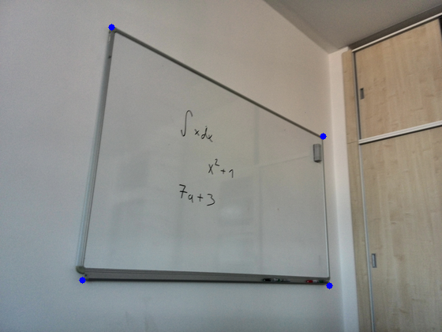

#Rozpoznávání příkladů z tabule

##Úvod, cíl práce

Cílem práce bylo vytvořit program, pomocí kterého bude robot číst příklady napsané na tabuli a hlásit výsledky. Robot by tedy měl pořídit fotografii tabule, na ní rozpoznat jednotlivé příklady a ty postupně spočítat.

Práci je tedy možno rozdělit do třech částí:
* Zpracování fotografie -- rozpoznání tabule a příkladů na ní
* Zpracování příkladů -- převod příkladů (obrázků) do vhodného textového formátu
* Výpočet příkladů -- v tomto případě s využitím API pro jazyk Mathematica 


##Zpracování fotografie tabule

V této části bude využita především knihovna pro zpracování obrazu OpenCV (verze 2.4.13). Knihovna kromě C++ podporuje i rozhraní pro Javu, Python a další jazyky. Já jsem se kvůli snadnému prototypování rozhodl pro implementaci programu použít Python (verze 2.7). Funkce z této knihovny v textu začínají **cv2.**.

### Rozpoznání tabule a transformace perspektivy

Nejdřív je potřeba vymezit plochu, na které se budou hledat příklady. Musí se tedy nalézt krajní body tabule a podle těchto bodů transformovat perspektivu tak, aby každý roh tabule odpovídal krajnímu bodu obrázku. Při použití obrázků s rozlišením 640x480 budou tedy krajní body tabule na souřadnicích (0,0), (640,0), (480,0), (640,480).

#### Hledání krajních bodů

Hledání krajních bodů tabule vychází z předpokladu, že tabule tvoří největší čtyřúhelník v obrázku.

Obrázek, ve kterém jsou hledány krajní body je nejprve převeden do odstínů šedé a oprahován funkcí **cv2.adaptiveThreshold()**. Zde se mi osvědčilo ještě před oprahováním na obrázek aplikovat Gaussian blur, který částečně omezí šum. 

Z takto upraveného obrázku jsou pak pomocí funkce **cv2.findContours()** získány kontury. Z těch je pak vybrána největší kontura, která odpovídá čtyřúhelníku. Jestli kontura tvoří čtyřúhelník zjistíme pomocí funkce **cv2.approxPolyDP()** aplikované na konturu. Pokud je křivka nalezná touto funkcí tvořena čtyřmi body, pak kontura tvoří čtyřúhelník.

```python
for contour in contours:
    area = cv2.contourArea(contour)
    if area > 100:
        peri = cv2.arcLength(contour, True)
        approx = cv2.approxPolyDP(contour, 0.02 * peri, True)
        if area > max_area and len(approx) == 4:
            biggest = approx
            max_area = area
```

#### Transformace perspektivy
Krajní body jsou využity k transformaci perspektivy pomocí funkcí **cv2.getPerspectiveTransform()** a **cv2.warpPerspective()**. Funkce **cv2.getPerspectiveTransform()** vytvoří matici transformace podle požadovaných bodů a funkce **cv2.warpPerspective()** pak podle této matice provede transformaci obrázku.

```python
#krajní body tabule
pts1 = np.float32([top_left, bottom_left, top_right, bottom_right])
#krajní body obrázku
pts2 = np.float32([[0, 0], [0, rows], [cols, 0], [cols, rows]])

M = cv2.getPerspectiveTransform(pts1, pts2)
dst = cv2.warpPerspective(gray, M, (rows, cols))
```



